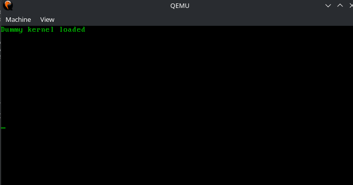

# bootloader-mk1

My first attempt at making a simple bootloader

## Requirement

* as (GNU Assembler)
* i686-elf-gcc
* i686-elf-ld
* objcopy
* qemu

## How to run

* Replace kernel.c with your own kernel
* Update the linker and makefile
* ```make run```

## Screenshots


